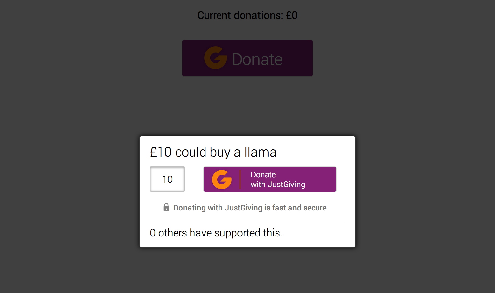

js-popup
--------

[](https://codeclimate.com/github/jamieallen59/js-popup)

A JavScript popup to prompt people to donate to a cause.



A user should be able to:
- select how much they would like to donate
- see how many people have already donated to this cause
- send the donation amount to a server to be stored

###Have a look
```sh
git clone git@github.com:jamieallen59/js-popup.git
cd js-popup
```
Go to 'views' folder and open 'index.html' in your browser.